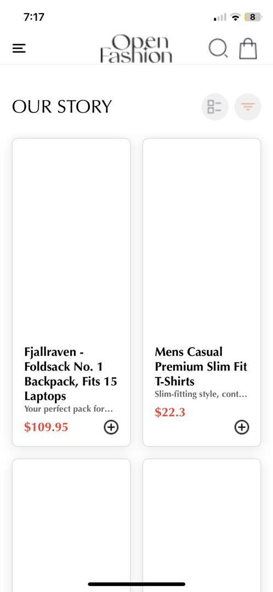
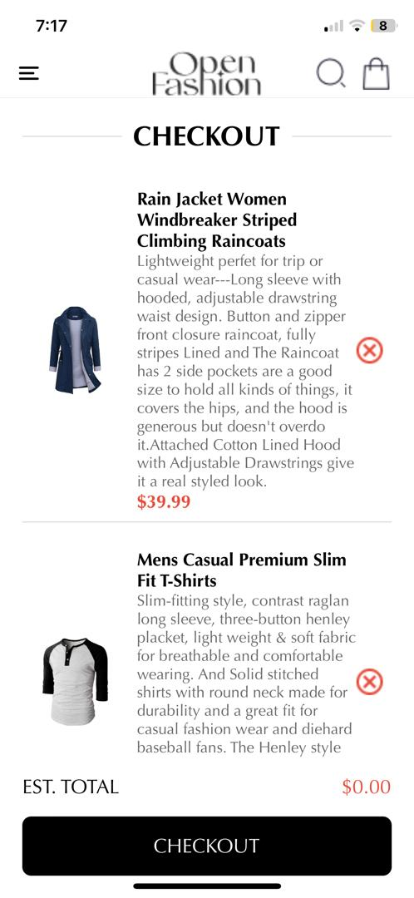
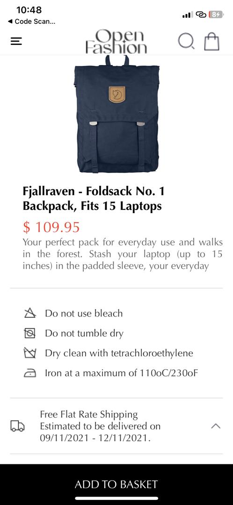
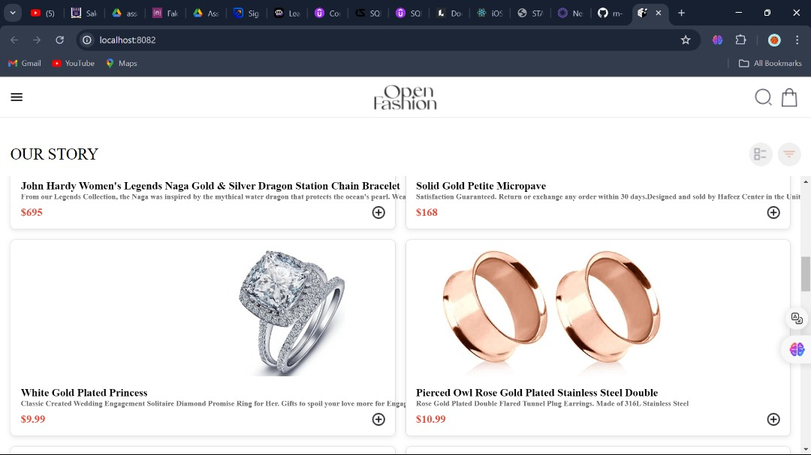

# rn-assignment7-11011833

assignment 7
Open Fashion App
This project is a React Native application that simulates a simple shopping cart. The app displays a list of products on the HomeScreen, allows users to add products to their cart, view the selected items in the CartScreen, and remove items from the cart, and also view detailed information of a selected product in the product details screen.

## Features

- Display a list of products on the Home Screen
- View detailed information about a selected product on the Product Detail Screen
- Add and remove products from the cart
- Checkout screen showing the list of items in the cart and the total price
- Navigation using a drawer menu

### 1. Home Screen (`HomeScreen.js`)

The Home Screen fetches a list of products from an API and displays them in a flat list. Each product item includes an image, title, and price. Tapping on a product navigates to the Product Detail Screen.

### 2. Cart Screen (`CartScreen.js`)

Cart screen shows the list of selected products in the cart.

### 3. Product Details Screen (`ProductDetailScreen.js`)

Product Details Screen shows the detailed information of a selected product. It also shows care instructions of the product.

Screenshots
Screenshot 1

screenshot 2

screenshot 3

screenshot 4

